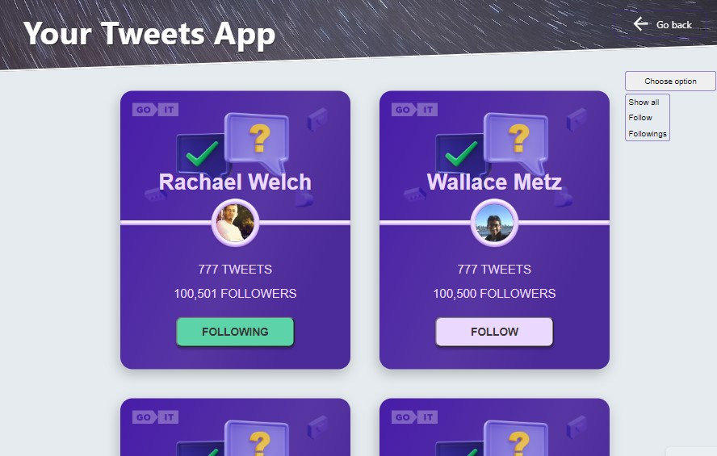

<h1>Tweets Cards App</h1>

You can find and follow tweets cards here
<h2>General Information</h2>

<ul>
<li>React application for displaying tweets cards. There's 2 pages: Home page and Tweets page. You can navigate beetween pages using links on the top rigth corner</li>
</ul><ul>
<li>Each user has a card with general information (name, avatar, tweets number, followers number). There's 12 cards on Tweets page. You can load more by pressing the button on the bottom of the page</li>
</ul><ul>
<li>Also you can follow any user, unfollow, or filter all users to see followed/not followed users</li>
</ul><h2>Technologies Used</h2>

<ul>
<li>HTML</li>
</ul><ul>
<li>CSS</li>
</ul><ul>
<li>JavaScript</li>
</ul><ul>
<li>React</li></ul>
<h2>Screenshots</h2>

<h2>Setup</h2>

To set up the project you can clone it from this repo: https://github.com/BogdanGlazkov/tweets-cards-app
<h5>Steps</h5><ul>
<li>npm ci</li>
</ul><ul>
<li>npm start</li>
</ul><ul>
<li>npm run build</li>
</ul><h5>Code Examples</h5><ul>
<li>This project uses React function components, some UI libraries, and React hooks. Here is a code example of Loader component</li>
</ul>

<code>import { ThreeDots } from "react-loader-spinner"; 
import s from "./Loader.module.css";  
export default function Loader() {   
    return (     
        &lt;div className={s.wrapper}&gt;       
        &lt;ThreeDots color="purple" /&gt;     
        &lt;/div&gt;   
        ); 
        }</code>

        
<h2>Project Status</h2>

Completed
<h2>Features that can be added</h2>

<ul>
<li>Cloud database</li>
</ul><ul>
<li>Authorization</li>
</ul><h2>Acknowledgement</h2>

<ul>
<li>This project was based on GoIT school tutorials</li>
</ul><h2>Contact</h2>

